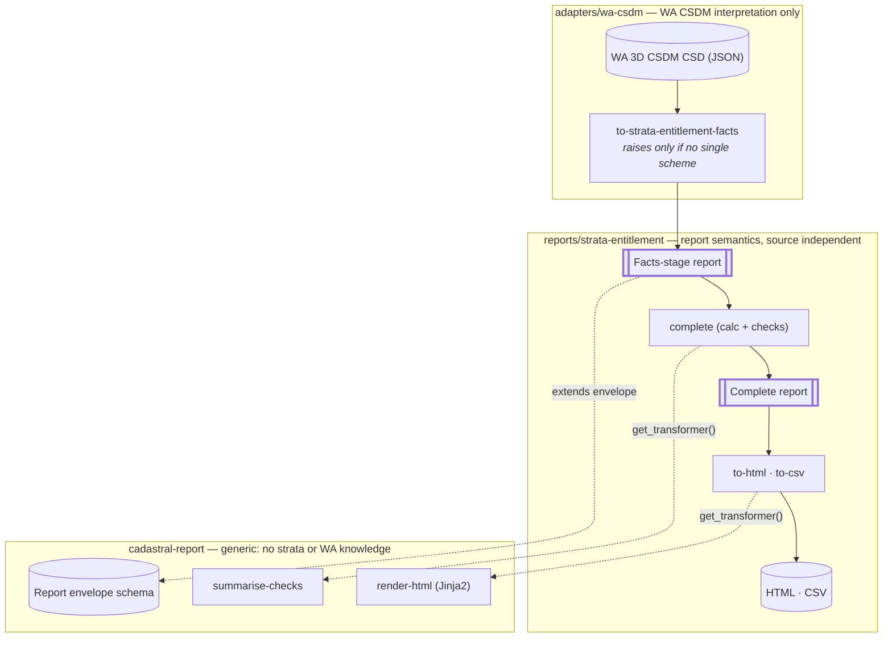

# Cadastral Reporting Building Blocks — Investigation & Plan

Last updated: 2026-10-02 · Author: Andrew Hunter

## Summary

Recommendation: build three Building Blocks: a generic **cadastral-report** block, a **strata-entitlement** report block and a **wa-csdm** source-adapter block. Use only standard `python` transforms composed with `get_transformer()`. No transform plugin is needed.

- **Don't add a separate normalised cadastral-data model yet.** The WA CSDM is already a profile of the OGC LADM land-parcels block (`entitlementPortion` is inherited from `ogc.ladm.land-parcels.parcel`). A second normalised model would duplicate it with no proven reuse. The source/semantics boundary comes from a **facts-stage report**: the same report schema, holding source facts only. The adapter produces it and a source-independent builder completes it. Revisit the intermediate model when a second report or second source shows duplicated extraction.
- **Provenance and status live in the generic model.** Every reportable value is a `ReportValue` with a status (`reported`, `derived`, `documented`, `configured`, `not-supplied`, `unresolved`, `conflicting`) and a JSON Pointer back to its source.
- **Missing data doesn't stop generation.** A report fails only when no single subject (scheme) can be identified. Everything else becomes an explicit check result inside the report.
- **Presentation is downstream.** HTML comes first, rendered from the validated structured report. CSV is a sibling transform. PDF is deferred and downstream of HTML.

The supplied example already shows why this matters:

- Scheme membership is recorded three ways (forward `references`, `containingPrimaryParcel` and `schemeRef`). After the 2026-10-01 dataset update all three list 9 lots, and the scheme's ParcelAggregate references are authoritative (D4). The other two links are consistency checks.
- The lot `interests` carry `entitlementPortion` as an integer where the schema says string. The `interestLink` that the LADM parcel schema requires was added on 2026-10-01.
- Valuer details are now structured (certifier, dateCertified) on the certification annotation.

Decisions D1–D17 were recorded on 2026-10-01 (section 9). Stage 0 can start.

Platform facts checked in `ghcr.io/opengeospatial/bblocks-postprocess:latest` (Python 3.10):

- Transforms run only on the **declaring block's own examples**.
- `outputs.profiles` validates outputs with JSON Schema, JSON-LD and SHACL.
- Snippets can override their validation schema with `schema-ref`.
- `get_transformer()` reaches local and imported blocks, and passes `extra_metadata` through.

## 1. Requirements analysis

The PDF is a one-page WA approved form (2021-47738). Its semantic core is small: one scheme, nine lot/entitlement pairs, one stated total and one valuer certification. Most of the rest is fixed form text or layout.

### What the PDF contains

| PDF element | Content in SP83687 | Category | In the CSDM? |
| --- | --- | --- | --- |
| Title "Schedule of Unit Entitlements" | fixed | Presentation / report type | No (report-type constant) |
| Approved form number | 2021-47738 | Source fact about the *referenced document* | Yes: `conformsTo` on the schedule supporting document |
| Effective for use from | 07/07/2021 | Form metadata | Via vocabulary: dcterms:valid on wa-approved-form:2021-47738 |
| Legislation | Strata Titles Act 1985; s37, Sch 2A cl. 21T(1)(d), 31E(1)(c) | Form metadata / legislative basis | Via vocabulary: skos:scopeNote on wa-approved-form:2021-47738 (free text) |
| Scheme Number | SP83687 | Source fact (identifier) | Yes |
| Scheme Address | 281 Belmont Avenue, Cloverdale | Source fact (needs formatting) | Structured parts only; same string as `schemeName` |
| Lot Number column | 1–9 | Source fact (identifier) | Yes, per lot appellation |
| Unit Entitlement column | 117, 108, 113, 108, 108, 113, 108, 108, 117 | Source fact (core) | Yes, per lot interest |
| Two side-by-side tables (lots 1–5, 6–9) | layout | Presentation only | n/a |
| "Sum of all unit entitlements" | 1000 | Declared fact **and** derivable value | Declared on the scheme interest; also computable (it sums to 1000) |
| Certificate of Licensed Valuer: wording, Land Valuers Licensing Act 1978, s37(3), ±5% rule | fixed | Form boilerplate (legal statement) | No |
| Valuer name, AAPI, licence no. 00000 | Jordan Example | Source fact (certification) | Yes: annotation certifier (firstName, lastName, licensedValuerNumber); AAPI only in description |
| Certification date | 17 May 2022 | Source fact (certification) | Yes: annotation dateCertified |
| Digital signature, logos, QR code, "Page 1 of 1" |  | Presentation / document authenticity | No |

### Separating the information

- **Source facts:** scheme number, scheme address, the lot set, each lot's number and unit entitlement, the declared total, the certification statement, and the schedule document reference (title, href, media type, form).
- **Derived facts:** calculated total (Σ entitlements = 1000), lot count (9), and per-lot proportion of total (optional; not on the PDF but cheap to derive).
- **Validation/check results:** scheme identified, members resolved and consistent, all lots have a valid entitlement, calculated total = declared total, and references to the schedule document and certification resolve. None of these are visible on the PDF; the form assumes them.
- **Presentation concerns:** column split, ordering by lot number, the form header, logos, the signature block, pagination and the QR code. The certificate wording is legal boilerplate. Treat it as a property of the report *type* (configured), not as data.

### How the PDF maps to the CSDM example

Every data element on the PDF can be traced to the CSDM. Form metadata comes from the WA vocabulary supplements rather than the CSDM. Only the signature is unavailable. Three things need care:

1. **Membership has three independent links.** These are the scheme's `topology.references` (ParcelAggregate), each lot's `containingPrimaryParcel` relationship, and each lot's new `schemeRef`. The scheme's references are authoritative for wa-built-strata (D4); the other two corroborate them. All three now list the same 9 lots. The report keeps per-lot `membershipEvidence` and a consistency check, because earlier versions of this dataset disagreed (2 forward vs 9 reverse).
2. **The address needs one vocabulary label.** `wa-locality:cloverdale` resolves to "Cloverdale" in `icsm-vocabs/vocabs/LandParcels/CSD-Header/wa-locality.ttl`. The road value now carries its own `label` ("Belmont Avenue") next to its IRI. `formatted` is therefore derived from the parts as "281 Belmont Avenue, Cloverdale", and is `unresolved` only when a label is missing (D8).
3. **Form metadata is in a vocabulary, not the CSDM.** `wa-approved-form-supplement.ttl` gives `2021-47738` a prefLabel, `dcterms:valid "2021-07-07/.."` (the effective date), `dcterms:source` and a `skos:scopeNote` naming the Strata Titles Act clauses. These are recorded as `reported` with a source reference to the vocabulary concept, not as report-type constants.

The example also carries context the entitlement PDF doesn't use: the former tenure (Lot 1 on DP 413673, CT 4027/1000), admin units, five plan-approval provenance activities, by-laws and notices documents, and the converter provenance (`wasGeneratedBy`). The report should reference the source dataset, not copy this content.

## 2. Source-to-report mapping

Thirteen report concepts trace to the CSDM. Three more come from WA vocabularies. No mapping issues remain open. Paths are relative to the CSD FeatureCollection. `S` is the scheme parcel and `L` is each lot parcel. Report paths refer to the conceptual model in section 4.

| # | Report concept | Source CSDM object / property | Extraction rule | Transformation / derivation | Target report property | Req. | Unresolved issue |
| --- | --- | --- | --- | --- | --- | --- | --- |
| 1 | Source dataset | root `id`, `name`, `time.date`, `featureType`=CSD; `@context` | Root of input | Copy; `conformsTo` = `wa-built-strata` when published, else `wa-3d` (D17) | `sources[0]` | Yes | None (D17 decided) |
| 2 | Scheme (subject) | `parcels[*].features[*]` with `properties.parcelPurpose` = `wa-parcel-purpose:strata-scheme` | Exactly one match; `scheme-id` parameter selects one when several | None | `subject.ref` (parcel `id` + pointer) | Yes | None (D5 decided) |
| 3 | Scheme number | `S.properties.schemeNumber` ("SP83687") | Direct | Trim; cross-check against root `name` and appellation `surveyNumber` ("SP 83687") | `content.scheme.schemeNumber` | Yes | `schemeNumber` awaits the `wa-built-strata` schema |
| 4 | Scheme address | `S.properties.schemeAddress.hasPart[]` | Direct; keep all parts | Format parts in apt order. Locality label from `icsm-vocabs` `wa-locality.ttl`. Road label from the `apt:road` value's `label` (reported). `formatted` = number + road + locality (derived), e.g. 281 Belmont Avenue, Cloverdale | `content.scheme.address.parts`, `.formatted` | Opt. | Locality label needs wa-locality at transform time |
| 5 | Scheme name | `S.properties.schemeName` | Direct | None | `content.scheme.schemeName` | Opt. | None |
| 6 | Member lots | `L` = features with `parcelPurpose` = `wa-parcel-purpose:strata-lot` and `parcelState` = created, whose `id` is in `S.topology.references` where `S.topology.type` = `ParcelAggregate` (authoritative). Corroborating links: `L.topology.relationships[role=containingPrimaryParcel].href` = `S.id`; `L.properties.schemeRef` = `S.id` | Members = S.topology.references where S.topology.type = ParcelAggregate (authoritative, D4). Reverse links corroborate only | Resolve each reference to a strata-lot feature; record corroborating links; consistency checks | `content.lots[]` (+ `membershipEvidence`) | Yes | None. All three links agree (9/9) in the current example |
| 7 | Lot number | `L.properties.appellation.hasPart[type=lotNumber].label` | First match | Keep as string; sort numerically when possible | `content.lots[].lotNumber` | Yes | Fallback to `appellation.label`? |
| 8 | Lot identity | `L.id`, `L.properties.appellation.label` | Direct | None | `content.lots[].parcel` | Yes | None |
| 9 | Unit entitlement | `L.properties.interests[interestType = wa-interest-type:strata-lot].entitlementPortion` | Exactly one matching interest | Coerce to positive integer; keep `lexicalValue`; flag non-integers (D7) | `content.lots[].entitlement` | Yes | Pending proposal: number (common) / integer (WA) |
| 10 | Declared total | `S.properties.interests[interestType = wa-interest-type:strata-scheme].entitlementTotal` | Exactly one matching interest | Coerce to integer | `content.totals.declared` | Opt. | Location kept; to be confirmed by `wa-built-strata` schema (D10) |
| 11 | Calculated total | Derived from #9 | n/a | Σ lot entitlements over lots whose entitlement status is `reported` | `content.totals.calculated` | Yes | None: partial sums are flagged incomplete |
| 12 | Lot proportion | Derived from #9, #11 | n/a | entitlement / calculated total | `content.lots[].proportion` | Opt. | Not on the PDF. Include? |
| 13 | Schedule document | `supportingDocuments[role = wa-survey-documentation-type:unitEntitlementSchedule]` | 0..1 match | Copy `title`, `href`, `type`, `conformsTo` | `documents[]`, `content.basis.schedule` | Opt. | `href` resolution `not-evaluated` until a base is defined (D12) |
| 14 | Approved form | `…unitEntitlementSchedule.conformsTo` (`wa-approved-form:2021-47738`) | From #13 | Keep CURIE; label, `dcterms:valid` and `dcterms:source` from `wa-approved-form-supplement.ttl` | `content.basis.schedule.conformsTo`, `.form` | Opt. | Vocabulary not yet published (D11) |
| 15 | Valuer certification | `annotations[role = wa-annotation-role:licensed-valuer-certification]`: `description`, `certifier.{firstName, lastName, licensedValuerNumber}`, `dateCertified` | 0..1 match | Statement verbatim; structured fields copied, never parsed from text (D9) | `content.basis.certification` | Opt. | None: annotation links to the schedule by href (rel via) |
| 16 | Legislative basis | `wa-approved-form:2021-47738` `skos:scopeNote` | Vocabulary lookup via #14 | Free text kept verbatim; status `reported`, source = vocabulary concept | `content.legislativeBasis` | Opt. | Clauses are prose, not structured references |
| 17 | Certificate wording, signature, QR code | Not in source | n/a | Not reproduced (D6) | none | No | None |
| 18 | Locality / LGA, former tenure | `adminUnit[]`, the former-tenure parcel | Not needed for this report | None | none (reachable via `sources`) | No | None |

The extraction rules for #2, #6, #7 and #9 are WA-CSDM specific: vocabulary IRIs and appellation structure. Rows #11, #12 and all checks are source-independent. That line sets the adapter/builder boundary in section 3.

## 3. Proposed architecture

Recommended pipeline: **CSDM → (adapter) facts-stage report → (builder) complete report → (renderer) HTML/CSV**. Each arrow is a `python` transform. One schema family validates both report stages. The user's candidate architecture is kept, with one change: "normalised cadastral reporting data" and "report model" are one schema used at two stages. They are not two models.



Key: cylinders are data or schemas, rectangles are `python` transforms, double-bordered boxes are reports validated by `outputs.profiles`, dashed arrows are `get_transformer()` calls or schema reuse.

Only the top band reads CSDM paths and WA vocabularies. A new source (another CSDM profile, an LADM dataset, a legacy format) adds one adapter transform that emits the same facts-stage report. A new report type adds one report block that reuses the bottom band.

### Evaluating the intermediate representation

| Option | Supports other CSDM profiles, jurisdictions, LADM, legacy | Cost | Verdict |
| --- | --- | --- | --- |
| A. CSDM → report directly, one transform | Poorly: calculations and checks are rewritten per source | Lowest | Rejected: calculations get tied to the WA CSDM |
| B. CSDM → generic normalised cadastral data model → each report | Well in theory | A second parcel/interest/document model that duplicates LADM land-parcels, which the CSDM already profiles | Deferred: no second consumer exists to prove the reuse |
| **C. CSDM → facts-stage report → complete report** | Well: a new source needs only a new adapter transform, and checks and calculations are reused | One schema with a stage marker | **Recommended** |

Option C gives the reuse that matters now. Option B's abstraction can be extracted later from real duplication. The trigger: when two adapter transforms repeat the same extraction (scheme resolution, membership, document index), promote it to a shared `resolve-scheme` transform or a small "scheme digest" component. Don't build it before then. (Stage 8: the trigger fired when the Scheme Composition Report was added, and resolve-scheme was promoted; see section 8.) LADM sources are the strongest argument for staying lean: the CSDM's parcel and interest properties are already LADM `ogc.ladm.land-parcels.parcel` terms. An LADM adapter would map almost one-to-one into the same facts stage.

### Building Blocks

| Block | Responsibility | Input | Output | Depends on | Why separate |
| --- | --- | --- | --- | --- | --- |
| `cadastral-report` (generic) | Report envelope, `ReportValue` with provenance and status, `Check`, `DocumentReference`, `ParcelReference`, status codelists. Generic transforms: `summarise-checks`, `render-html` | Any report JSON | Validated report; HTML | none (later: LADM ontology for semantics) | Shared by every report type; knows nothing about strata or WA |
| `reports/strata-entitlement` | Entitlement report content schema (extends the envelope). Transforms: `complete` (calculations and domain checks), `to-html` (template + generic renderer), `to-csv` | Facts-stage entitlement report | Complete entitlement report; HTML; CSV | `cadastral-report` | Report semantics, independent of any source format |
| `adapters/wa-csdm` | WA-CSDM interpretation: find the scheme, resolve members, read appellations, interests, documents and annotations. One extraction transform per report type, plus composed end-to-end transforms | WA 3D CSDM CSD (JSON) | Facts-stage report (per report type) | WA profile register (`icsm.profiles.wa.*`), report blocks | The only block that knows CSDM paths and WA vocabularies. Transforms run on the declaring block's examples, so CSDM examples must live here |

Three blocks, not five. (As built after Stage 8: five, because the generic vocabulary became its own block in Stage 7 and the Scheme Composition Report was added in Stage 8.) Reusable components (`ReportValue`, `Check`, `DocumentReference`) start as `$defs` with `$anchor`s inside `cadastral-report`. Split them into a `components/` block only if a non-report schema needs them. A separate presentation block isn't justified: presentation transforms belong to the block whose data they render.

## 4. Proposed information models

The generic model is justified: the envelope, provenance-bearing values, checks and document references recur in every report type listed. The entitlement model adds only `scheme`, `lots`, `totals` and `basis`. These are conceptual structures, not final schemas.

### Generic cadastral report (`cadastral-report`)

```yaml
CadastralReport:
  id: IRI/URN                      # generated, stable per (reportType, subject, source)
  reportType: IRI                  # e.g. .../report-type/strata-entitlement
  stage: facts | complete          # facts = adapter output; complete = builder output
  generatedAt: dateTime
  generatedBy: [ {bblock, transform, version} ]   # one entry per pipeline step
  subject: { kind: IRI (scheme|parcel|plan|...), ref: SourceRef, label: string }
  sources: [ SourceDataset ]       # {id, name, date, conformsTo: profile IRI, href?}
  status: complete | incomplete | invalid          # rolled up from checks (complete stage only)
  checks: [ Check ]
  documents: [ DocumentReference ]
  annotations: [ AnnotationReference ]             # {role IRI, statement, href?, sourceRef}
  content: {}                      # extension point, typed by the report-type block

ReportValue<T>:                    # used wherever a value needs provenance
  value: T | null
  status: reported | derived | documented | configured | not-supplied | unresolved | conflicting
  sourceRefs: [ SourceRef ]        # {dataset: id, pointer: JSON Pointer, property: IRI?}
  derivation: { method: IRI, inputs: [ JSON Pointer into this report ] }   # when derived
  documentRef: id                  # when documented
  lexicalValue: string             # original value when coerced (e.g. "117" -> 117)
  note: string

Check:
  id, checkType: IRI
  category: source-conformance | generation | domain
  severity: error | warning | info
  outcome: pass | fail | not-evaluated | not-applicable
  message: string
  targets: [ JSON Pointer into this report ]
  evidence: {}                     # small structured payload, e.g. {expected: 1000, actual: 1000}

DocumentReference: { id, title, href, mediaType, role: IRI, conformsTo: IRI, sourceRef }
ParcelReference:   { id (source feature id), label, lotNumber?: ReportValue<string>, sourceRef }
```

The provenance statuses answer the brief:

- **reported**: taken directly from a source property.
- **derived**: calculated, with `derivation.inputs` pointing at other report values.
- **documented**: known only from a referenced supporting document.
- **configured**: a report-type constant, such as fixed report wording. The entitlement report needs none now that legislation comes from the form vocabulary.
- **not-supplied**: expected but absent.
- **unresolved**: a reference that couldn't be followed.
- **conflicting**: sources disagree.

Because provenance lives in the generic `ReportValue`, report types never invent their own. Semantically, `sourceRefs`/`derivation` can later map to PROV-O (`prov:wasDerivedFrom`, `prov:wasGeneratedBy`). That needs no structural change.

### Strata Scheme Entitlement Report (`reports/strata-entitlement`)

```yaml
StrataEntitlementReport (extends CadastralReport; reportType = strata-entitlement):
  content:
    entitlementKind: IRI             # unit entitlement (WA). Other kinds, e.g. liability or
                                     # contribution schedules, fit without a schema change
    scheme:
      parcel: ParcelReference
      schemeNumber: ReportValue<string>
      schemeName:   ReportValue<string>
      address: { formatted: ReportValue<string>, parts: [ {partType: IRI, value} ] }
    lots: [                          # one per resolved member, ordered by lotNumber
      { parcel: ParcelReference,
        lotNumber: ReportValue<string>,
        entitlement: ReportValue<integer>,
        proportion: ReportValue<number>,                 # derived, complete stage only
        membershipEvidence: [references | containingPrimaryParcel | schemeRef] }
    ]
    totals:
      declared:   ReportValue<integer>                   # reported (scheme interest) or not-supplied
      calculated: ReportValue<integer>                   # derived, complete stage only
      lotCount:   ReportValue<integer>                   # derived
    basis:
      schedule:      DocumentReference id                # the unit entitlement schedule document
      certification: { statement: ReportValue<string>,   # verbatim annotation text
                       certifier: {firstName, lastName, licensedValuerNumber}, dateCertified: ReportValue (reported) }
    legislativeBasis: [ ReportValue<{label, href}> ]     # reported from wa-approved-form scopeNote
```

What's deliberately absent: geometry, solids, survey observations, former tenure, admin units, by-laws and approval provenance. The report links to these through `sources` and `subject.ref`. It doesn't copy them, which keeps duplication of the source model to the minimum the report needs.

## 5. Transform pipeline

The pipeline uses six `python` transforms in three blocks, plus two composition transforms, linked with `get_transformer()`. The only third-party dependency is `jinja2`, declared through `metadata.dependencies.pip` for HTML. No plugin is needed. Domain extraction and calculation stay in Python, where they can be unit-tested, and none of it is embedded in presentation.

| Transform (block) | Input | Output (+ `outputs.profiles`) | Generic or specific | What it does |
| --- | --- | --- | --- | --- |
| `to-strata-entitlement-facts` (`adapters/wa-csdm`) | CSDM CSD JSON | Facts-stage report JSON; profile `…reports.strata-entitlement` | WA-CSDM + report specific | Finds the scheme; resolves members (both directions); reads lot numbers, entitlements, declared total, documents and annotations; sets `reported`/`not-supplied` statuses and JSON Pointers; emits generation checks. Raises only when no single scheme is found |
| `complete` (`reports/strata-entitlement`) | Facts-stage report | Complete report; same profile | Report specific, source independent | Calculates total, lot count and proportions as `derived` with inputs. Runs domain checks. Calls `get_transformer('…cadastral-report', 'summarise-checks')` to set `status` |
| `summarise-checks` (`cadastral-report`) | Any report | Same report with `status` set | Generic | Rolls up checks: any `error`/`fail` gives `invalid`; any `not-supplied` required value gives `incomplete`; otherwise `complete` |
| `render-html` (`cadastral-report`) | Any complete report + `extra_metadata.template` | `text/html` (`defaultExtension: html`) | Generic | Jinja2 environment with shared macros: envelope header, status badge, provenance marker per `ReportValue`, checks table, documents list. The report-specific body comes from the template passed in |
| `to-html` (`reports/strata-entitlement`) | Complete report | `text/html` | Report specific (template only) | Holds the entitlement body template in `metadata.template`, so it is published in `register.json` and usable outside the build. Calls `render-html` with that template as `extra_metadata` |
| `to-csv` (`reports/strata-entitlement`) | Complete report | `text/csv` | Report specific | One row per lot: lot number, entitlement, status, proportion. Standard library only |
| `to-strata-entitlement-report` and `…-html` (`adapters/wa-csdm`) | CSDM | Complete report / HTML | Composition only | Chains facts → `complete` → `to-html` with `get_transformer()`. They exist so the CSDM example produces every artefact in one build, and so consumers get a one-call conversion |

Platform constraints that shape this design:

- **Transforms only see their own block's examples.** The postprocessor loops over the declaring block's `examples` only (`apply_transforms` in `transform.py`). CSDM→report transforms must therefore live on a block whose examples are CSDM: the adapter. The report block's examples are reports.
- **Shared code means shared transforms.** `python` code is `exec`'d from `code`/`ref` and inlined into the register. Python helpers can't be imported across transforms. Text-in/text-out via `get_transformer()` is the only standard reuse path. That is why the generic pieces (`summarise-checks`, `render-html`) are transforms, and why templates travel as metadata rather than files. `context.bblock_files_path` is only available inside a build.
- **Nested calls get less context.** A nested call receives `source_mime_type=None` and the target's own metadata merged with `extra_metadata`. Pass anything else explicitly. Use `_nested_transform` to keep a sub-transform's output quiet.
- **Output profiles do the model validation.** `outputs.profiles: [bblocks://…reports.strata-entitlement]` validates each output (JSON Schema + JSON-LD + SHACL) into `build/tests/…/transforms/`.
- **Python 3.10** in the current image. Avoid 3.11+ syntax.
- **Minor caveat:** the `get_transformer` registry lists `jsonld-frame` while the declared type is `json-ld-frame`, so JSON-LD frame transforms may not be callable as composition targets. Not needed here.

PDF stays downstream and out of the build: HTML → PDF (for example WeasyPrint or a headless browser) is a later, separate transform or an external step. Its heavy native dependencies don't belong in register CI. Signing and form-authentic layout are out of scope (D6).

## 6. Validation strategy

Validation runs at four layers. Only the generation layer can stop a report from being produced. The other layers produce findings, recorded inside the report as `checks` (or, for source conformance, in a separate report). Updated 2026-10-02 to the checks implemented through Stage 5.

| Layer | What is validated | Mechanism | Where | On failure |
| --- | --- | --- | --- | --- |
| Source-data conformance | The CSDM against its profile (`icsm.profiles.wa.wa-3d`; `wa-built-strata` once published) | `scripts/check_source_conformance.sh`: the WA profile's JSON Schema (every error listed), JSON-LD uplift and SHACL shapes; plus the adapter's `entitlement-source-datatype` check in the report | Findings in `adapters/wa-csdm/description.md`; one check in the report | Recorded, never blocks |
| Report-generation requirements | Exactly one strata scheme parcel (a `scheme-id` parameter is planned for multi-scheme CSDs) | Adapter code; `scheme-identified` check | `to-strata-entitlement-facts` | 0 or more than 1 scheme: the transform raises. Everything else continues |
| Report-model conformance | Both stages against the report schema: `ReportValue` status rules (e.g. `derived` needs `derivation`), derived totals forbidden at `facts` and required at `complete`, `status` and `checks` required at `complete` and `status` forbidden at `facts` | JSON Schema | `outputs.profiles` on every transform; examples; 25 must-fail tests | Build test failure: a bug in a transform or schema |
| Business / domain validation | Membership, lot numbers, entitlements, totals, documents | `Check` objects from the adapter (source-specific) and `complete` (report-level); the generic `summarise-checks` sets `status` | `to-strata-entitlement-facts`, `complete` | Recorded in the report; `status` becomes `incomplete` or `invalid`; the report is still produced |

### Report status

The generic `summarise-checks` transform (`cadastral-report`) sets `status` from the checks, the same way for every report type, and keeps the counts in `statusSummary`.

| Status | Rule | Meaning |
| --- | --- | --- |
| `invalid` | any `error` check fails | information is wrong or inconsistent |
| `incomplete` | otherwise, any `warning` check fails, or an `error` check could not be evaluated | information is missing |
| `complete` | otherwise | `info` results and checks not yet evaluated at `warning`/`info` severity do not change the status |

### Entitlement checks and their result on SP83687

| Check | Defined by | Category | Severity | Fails when | Result on SP83687 |
| --- | --- | --- | --- | --- | --- |
| `scheme-identified` | adapter | generation | error | never in a produced report (no single scheme stops generation) | pass |
| `membership-parcel-aggregate` | adapter | domain | error | the scheme topology is not `ParcelAggregate` or has no references | pass: 9 references |
| `membership-references-resolve` | adapter | domain | error | a reference is not a strata-lot parcel of the dataset (unresolved lots stay in `lots[]`) | pass: 9/9 |
| `membership-back-links` | adapter | domain | warning | a member's `containingPrimaryParcel` is missing or another parcel, or its `schemeRef` names another parcel (no `schemeRef` is acceptable) | pass: 9/9 |
| `membership-unreferenced-claimants` | adapter | domain | warning | a strata lot links to the scheme but is not referenced (reported, not added) | pass: none |
| `entitlement-source-datatype` | adapter | source-conformance | info | an `entitlementPortion` is a number (`wa-3d` types it as a string) | fail: 9 numbers |
| `scheme-number-consistent` (Stage 5) | adapter | domain | warning | `schemeNumber` differs, ignoring spaces, from the CSD `name` or the scheme appellation's `surveyNumber` | pass: SP83687 = SP83687 = SP 83687 |
| `lot-numbers-present` | report | domain | warning | a lot has no lot number | pass |
| `lot-numbers-unique` | report | domain | error | two lots share a lot number | pass: 9 unique |
| `entitlements-present` | report | domain | warning | a lot's entitlement is `not-supplied` or `unresolved` | pass: 9/9 |
| `entitlements-valid` | report | domain | error | a lot's entitlement is `invalid` or `conflicting` | pass |
| `total-covers-all-lots` | report | domain | warning | the calculated total leaves out a lot | pass: 1000 from 9 lots |
| `declared-total-present` | report | domain | warning | the source declares no usable total | pass: 1000 |
| `total-matches-declared` | report | domain | error | calculated ≠ declared (not evaluated when either is incomplete) | pass: 1000 = 1000 |
| `schedule-document-referenced` | report | domain | warning | the report references no schedule of unit entitlements | pass: Schedule of Unit Entitlements – SP83687 |
| `document-hrefs-resolvable` | report | generation | info | (not run: links are not resolved during generation, and relative links have no base; D12) | not evaluated |
| `valuer-certification-present` | report | domain | warning | no certification, or it lacks the valuer's last name, licence number or date | pass: Jordan Example, No. 00000, 2022-05-17 |
| `certification-linked-to-schedule` | report | domain | info | the certification links to a different document (not applicable when either is missing) | pass |

Result: SP83687 is `complete` (18 checks, 0 failed errors, 0 failed warnings, 0 unevaluated errors). Gaps in the basis of the schedule are warnings, so they make a report `incomplete`: a missing schedule document, a missing certification, or one without the valuer's name, licence number or date.

Missing data is never silent, and it is kept separate from wrong data:

- **Missing gives `incomplete`.** A lot with no entitlement stays in `lots[]` as `not-supplied`. `entitlements-present` and `total-covers-all-lots` fail (warnings), and `total-matches-declared` is not evaluated because a partial sum cannot be compared. Example: `missing-entitlement.json`.
- **Wrong gives `invalid`.** An invalid or conflicting entitlement, duplicate lot numbers, an unresolvable or non-lot member reference, or a calculated total that differs from the declared one fails an `error` check. Example: `total-mismatch.json` (declared 1100, lots sum to 1000).
- **No identifiable scheme stops generation.** Fixture: `tests-py/fixtures/no-scheme.json`.

Changes from the original plan: "every lot has exactly one entitlement" (error) was split into `entitlements-present` (warning) and `entitlements-valid` (error), and lot numbers likewise, so that missing data makes a report `incomplete` rather than `invalid`. A scheme with no members still produces a report (with no lots), marked `invalid` by its checks. Stage 5 added `scheme-number-consistent`, the cross-check the mapping table (row 3) asked for, and evaluates the document and certification checks against the report's own `documents`, `annotations` and `basis`, so they stay independent of the source format.

## 7. Proposed repository structure

The template's `_sources/myFeature` and `_sources/mySchema` are replaced by three blocks. Nothing else in the template changes except `bblocks-config.yaml` and the README. The prefix `csdm.reporting.` was confirmed in D1.

```text
bblocks-config.yaml            # identifier-prefix: csdm.reporting.
                               # imports: [default, https://surroundaustralia.github.io/3d-csdm-profile-wa/build/register.json]
                               # no plugins section
data/examples/                 # unchanged: raw requirement sources (PDF, full 820 KB CSDM); not published as blocks
_sources/
  cadastral-report/                            # csdm.reporting.cadastral-report
    bblock.json                                # itemClass: schema
    description.md                             # pipeline, provenance statuses, how to add a report type / source
    schema.yaml                                # envelope + $defs: ReportValue, Check, DocumentReference, ParcelReference
    context.jsonld                             # Stage 7: maps to PROV-O / LADM terms
    data.ttl                                   # SKOS codelists: value-status, check-outcome, check-category, report-status
    examples.yaml                              # a minimal generic report (no domain content)
    transforms.yaml                            # summarise-checks, render-html (ref: transforms/*.py, pip: jinja2)
    transforms/summarise_checks.py
    transforms/render_html.py                  # shared Jinja2 macros inlined as strings
    tests/                                     # e.g. derived-without-derivation-fail.json
  reports/
    strata-entitlement/                        # csdm.reporting.reports.strata-entitlement
      bblock.json                              # dependsOn: none needed (schema $refs the envelope)
      description.md                           # report semantics, check catalogue, mapping table (section 2)
      schema.yaml                              # allOf: [bblocks://csdm.reporting.cadastral-report, {content: …}]
      shapes.shacl                             # Stage 7: e.g. complete stage => calculated total present
      examples.yaml                            # facts-stage and complete-stage SP83687 reports
      examples/sp83687-facts.json
      examples/sp83687-complete.json
      transforms.yaml                          # complete, to-html (metadata.template), to-csv
      transforms/complete.py
      transforms/to_html.py
      transforms/to_csv.py
      tests/                                   # complete-without-totals-fail.json, bad-status-fail.json, …
  adapters/
    wa-csdm/                                   # csdm.reporting.adapters.wa-csdm
      bblock.json                              # dependsOn: wa-built-strata when published, else icsm.profiles.wa.wa-3d (D17)
      description.md                           # CSDM interpretation rules, membership rule, vocab IRIs used
      examples.yaml                            # CSDM inputs (trigger the transforms)
      examples/sp83687-entitlement.json        # trimmed fixture: geometry collections stripped (~20 KB)
      examples/missing-entitlement.json        # small synthetic variants, also run through the transforms
      examples/total-mismatch.json
      examples/no-scheme.json                  # generation error: documents the hard-failure path
      transforms.yaml                          # to-strata-entitlement-facts, -report, -html
      transforms/strata_entitlement_facts.py
```

Notes on placement:

- **Schemas** sit in each block's `schema.yaml`. The report schema extends the envelope by `$ref`. The adapter has no schema of its own (D3).
- **Transforms** sit next to the data they consume. `.py` files are referenced with `ref:` so they stay readable and lintable. The postprocessor inlines them into `register.json`.
- **Examples** use a trimmed CSDM fixture, not the 820 KB original. The original's solids, faces and points aren't read by the entitlement report and would slow every build. Synthetic variants are examples rather than `tests/`, because only examples are run through transforms.
- **Templates** for HTML are strings in `transforms.yaml` `metadata` or inside the `.py`. They are not loose files, so `get_transformer()` consumers outside the build still get them.
- **Documentation** lives in each block's `description.md`. This investigation can become `cadastral-report/description.md` once approved.
- **Unit tests** for the Python logic: optional `tests-py/` at the repository root (pytest, run outside the postprocessor). It is not a Building Block concern, but it speeds iteration.

## 8. Implementation stages

There are nine stages, numbered 0 to 8. Stage 1 is a thin end-to-end slice (CSDM → report → HTML for nine lots and a total). Each later stage adds one concern and leaves the build green. Every stage completes with `./build.sh` (or `--steps transforms,tests` with `--filter`) passing locally.

0. **Register setup and source baseline**
   - Files: `bblocks-config.yaml` (prefix, WA import), remove `_sources/myFeature` and `_sources/mySchema`, `README.md`, add `adapters/wa-csdm/examples/sp83687-entitlement.json` (trimmed fixture).
   - Behaviour: none yet. Record source conformance by validating the full example against `icsm.profiles.wa.wa-3d`. This confirms or refutes the expected datatype failures.
   - Tests: the postprocessor runs with no local errors; the WA import resolves.
   - Done when: the build is green, the conformance findings are noted in `adapters/wa-csdm/description.md`, and the vocabulary sources for D8, D11 and row 14 are located (icsm-vocabs LandParcels, WA `*_supplement.ttl`, WA proposal CSVs).
1. **Vertical slice**
   - Files: `cadastral-report/{bblock.json,schema.yaml}` (minimal envelope: `reportType`, `subject`, `sources`, `content`), `reports/strata-entitlement/{bblock.json,schema.yaml,examples.yaml,transforms.yaml}`, `adapters/wa-csdm/{bblock.json,examples.yaml,transforms.yaml,transforms/strata_entitlement_facts.py}`.
   - Behaviour: one adapter transform produces a report with scheme number, lots (number + entitlement as plain values) and calculated total. One `to-html` transform in the report block renders a plain table with Python's standard library. The adapter's composed `-html` transform proves `get_transformer()`.
   - Tests: the transform output validates against `outputs.profiles`, and a hand-written expected report example is valid. Assert 9 lots and total 1000.
   - Done when: `build/tests/…/adapters/wa-csdm/transforms/` contains a valid JSON report and an HTML file listing 9 lots and 1000.
2. **Split source extraction from report semantics**
   - Files: add `stage` to the envelope; add `reports/strata-entitlement/transforms/complete.py`; slim the adapter to the facts stage.
   - Behaviour: the adapter emits facts only. `complete` calculates the total and lot count. The composed adapter transforms chain facts → complete → html.
   - Tests: a facts-stage example and a complete-stage example in the report block; a `-fail` test for `stage: complete` without totals.
   - Done when: no calculation code remains in the adapter, and outputs are identical to Stage 1 apart from `stage`.
3. **Provenance and explicit status**
   - Files: `ReportValue` in the envelope, `data.ttl` value-status codelist, adapter and `complete` updated.
   - Behaviour: every lot number, entitlement and total is a `ReportValue` with a status and JSON Pointer. `derived` values carry inputs. Coercion keeps `lexicalValue`.
   - Tests: `examples/missing-entitlement.json` (adapter) yields `not-supplied`, not an exception; a `-fail` test for `derived` without `derivation`.
   - Done when: the HTML marks each value's status, and the missing-entitlement example produces a valid report.
4. **Checks and status roll-up**
   - Files: `Check` in the envelope, `cadastral-report/transforms/summarise_checks.py`, check catalogue in `complete.py`, adapter generation checks, membership-evidence logic (per D4).
   - Behaviour: all checks in section 6, with report `status` set by the generic `summarise-checks`.
   - Tests: `total-mismatch.json` gives `invalid`; SP83687 gives a membership warning; `no-scheme.json` documents the raised error.
   - Done when: every row of the section 6 check table appears in the SP83687 report with the stated outcome.
5. **Scheme context, documents and basis**
   - Files: `DocumentReference`/`AnnotationReference` in the envelope, adapter extraction of `schemeName`, address parts, schedule document and certification annotation; `legislativeBasis` as `configured`.
   - Behaviour: the report carries everything in the section 2 mapping. Address formatting follows D8.
   - Tests: assertions on document role and `conformsTo`, and that the certifier, `dateCertified` and form validity are `reported`.
   - Done when: every mapping row marked Yes/Opt. is populated or explicitly statused.
6. **Generic presentation**
   - Files: `cadastral-report/transforms/render_html.py` (Jinja2), `reports/strata-entitlement/transforms/{to_html.py,to_csv.py}`.
   - Behaviour: shared header, status badge, provenance markers, checks and documents. Entitlement body comes from a template in metadata. CSV output.
   - Tests: HTML output for SP83687 and missing-entitlement; CSV with 9 rows.
   - Done when: the Stage 1 standard-library renderer is deleted and the report-specific code is template-only.
7. **Semantics and SHACL** (can run in parallel with 6)
   - Files: `context.jsonld` for both report blocks, `shapes.shacl`; optionally an ontology block, following `bblocks/schema-ontology` (reuse PROV-O and LADM terms; mint only report-specific terms).
   - Behaviour: reports uplift to RDF; SHACL enforces cross-field rules.
   - Tests: uplifted examples pass SHACL; one SHACL negative test.
   - Done when: the Turtle output links `entitlementPortion` provenance to the LADM IRI `https://w3id.org/ogc/ladm/parcels/entitlementPortion`.
8. **Generalisation check**
   - Files: a design note, or a skeleton second report: "scheme composition", which would produce the `members` and `spatialRepresentationSummary` that the WA scope note says should be "generated via a reporting transform".
   - Behaviour: confirms no strata assumptions leaked into `cadastral-report`, and measures adapter duplication against the trigger in section 3.
   - Done when: the second report needs no change to `cadastral-report`, or the needed changes are listed and justified.

### Stage 8 result (2026-10-02)

The architecture generalised. A second report type, the **Scheme Composition Report** (`csdm.reporting.reports.scheme-composition`), was built on the generic blocks as they stood after Stage 7 and needed **one** change there. It produces the `members` and `spatialRepresentationSummary` that the WA built-strata scope note says should be generated by a reporting transform. Full detail: `docs/stage-8-generalisation-check.md`.

| Question | Finding |
| --- | --- |
| Did the second report need changes to `cadastral-report`? | One: `render-html` now shows list values comma-separated (an empty list as "none") and booleans as yes/no, instead of Python representations. The envelope schema, `ReportValue`, `Check`, `summarise-checks`, the JSON-LD context, the vocabulary, the codelists and the SHACL rules were unchanged. The entitlement HTML is byte-identical |
| Did strata or WA assumptions leak into the generic blocks? | No. "Strata" appears there only in "for example" description text |
| Did the section 3 duplication trigger fire? | Yes. The new report needed the same scheme resolution, membership checks, lot numbers and scheme-number check. They were promoted to a shared `resolve-scheme` transform in the adapter: `to-strata-entitlement-facts` went from 465 to 342 lines, `to-scheme-composition-facts` is 107, and the entitlement outputs are byte-identical |
| What does the second report say about SP83687? | `incomplete`: 9 members, all `AggregateSolid`; Lots 1 and 2 are spatially resolved (4/4 and 5/5 component solids present), Lots 3 to 9 have no solids yet, and no lot has a representation status. An accurate picture of the dataset |

Other Stage 8 changes:

- **Fixture:** the trimmed fixture keeps the `solids` collection (7 KB), which the composition report needs; the entitlement outputs are unchanged.
- **Tests:** the semantic consistency tests now discover every context and vocabulary in the register.

Deferred findings:

- **Shared strata vocabulary:** the `se:` and `sc:` vocabularies both define `scheme`, `schemeNumber`, `lotNumber` and `membershipEvidence`. Promote them when a third strata report needs them, by the same rule as `resolve-scheme`.
- **Repeated helpers:** about 30 lines (`_pointer`, `_ref`, `_value`) repeat across the three adapter transforms, because `python` transforms cannot import each other. Accepted.
- **No default representation status:** the report reports what the source supplies; a default `representation-status:d3d` belongs in the source profile.
- **`components[].found`:** a plain boolean, not a `ReportValue`; revisit only if components need their own provenance.

## 9. Open issues and architectural decisions

All 17 decisions were made on 2026-10-01. Nothing blocks Stage 0. Three items stay open upstream and are handled by explicit status in the report until they're resolved.

### Decision record

| # | Decision | Outcome |
| --- | --- | --- |
| D1 | Identifier prefix | `csdm.reporting.` |
| D2 | Intermediate representation | Option C (facts-stage report), with the promotion trigger in section 3 |
| D3 | Adapter validation | No schema now; `dependsOn` the WA block; source conformance is a Stage 0 finding. Switch to `$ref` once `wa-built-strata` is published and the example conforms |
| D4 | Scheme membership | For `wa-built-strata`, the authoritative member list is the scheme parcel's `topology.references`, where `topology.type` = `ParcelAggregate` and `parcelPurpose` = `wa-parcel-purpose:strata-scheme`. Lots' `containingPrimaryParcel` and `schemeRef` links are kept as per-lot `membershipEvidence` and checked for consistency, but don't add members |
| D5 | Failure policy | Fail only on 0 or more than 1 scheme; `scheme-id` parameter for multi-scheme CSDs; everything else is a check |
| D6 | Report identity | A derived report: cites the form via `conformsTo` and the lodged PDF via `documents`; no form wording, signature or QR code |
| D7 | Entitlement datatype | Coerce to positive integer, keep `lexicalValue`, flag non-integers. A pending proposal changes the common type to number and the WA type to integer |
| D8 | Address formatting | Keep structured parts. The road label is carried in the CSDM as a `label` on the `apt:road` value (added 2026-10-01). `formatted` is derived from the parts and is `unresolved` only when a label is missing. Label sources: approved vocabularies in `icsm-vocabs/vocabs/LandParcels` (e.g. `wa-locality.ttl`), WA `profiles/*_supplement.ttl`, draft CSVs in `proposals/development/vocabularies` |
| D9 | Valuer certification | Dataset now carries `certifier.{firstName, lastName, licensedValuerNumber}` and `dateCertified` on the annotation. Map directly; don't parse `description` |
| D10 | `entitlementTotal` location | Current location (scheme interest), to be confirmed by the `built-strata` profile schema |
| D11 | Vocabulary prefixes | Accepted: adapter IRIs are constants, revised when vocabularies are approved and published |
| D12 | Relative `href` | Accepted: resolution check is `not-evaluated` until a base is defined |
| D13 | `parcelState` filter | Agreed: lots must be `created` |
| D14 | PDF | HTML is the stable output; PDF tooling only if a client requests it |
| D15 | Ontology depth | Agreed: Stage 7 |
| D16 | Component promotion | Agreed: triggered by Stage 8 evidence. Outcome (Stage 8): resolve-scheme promoted within the adapter; components stay inside cadastral-report; a shared strata vocabulary is deferred to a third strata report |
| D17 | Source profile | Target `wa-built-strata` (the report only applies to built strata). Until it is published, use `wa-3d`; only `dependsOn`, `sources.conformsTo` and adapter docs change |

### Still open upstream

| Item | Effect on the report until resolved | Owner |
| --- | --- | --- |
| Road-name labels: resolved in the example by a `label` on the `apt:road` value; to be adopted in the WA profile (ICSM Addresses defines part types only, not roads) | Report uses the label when present; otherwise `address.formatted` is `unresolved` | WA profile |
| Publication of `wa-built-strata` and the WA supplement vocabularies | Adapter targets `wa-3d`; vocabulary lookups read local or published `.ttl`; IRIs are constants | Surround / Landgate |
| Entitlement datatype proposal (number / integer) | Coercion stays; the datatype check moves from `info` fail to pass once adopted | Surround |

Dataset fixes made on 2026-10-01:

- Annotations with an `href` are now JSON-FG links (`href`, `rel`, `role`), and the valuer certification links to the schedule document.
- `interestLink` values are prefixed names (`wa-title:`, `wa-interest:`) declared in the CSD `@context`. They use placeholder `example.com` namespaces until Landgate URIs are known.
- Address part types use `apt:addressNumberFirst`, and both road values carry labels.

Lots 3–9 still have empty `AggregateSolid` references. This doesn't matter for entitlements, but it does for a future composition report.

One implementation note for Stage 5: vocabulary lookups (locality, form validity and scopeNote) need the `.ttl` sources at transform time. The Python transform can fetch published vocabularies when available. Until then it can read a small label table carried in the adapter's transform `metadata`, generated from the local `.ttl` files. Values found that way are `reported` with the concept IRI as their source.
